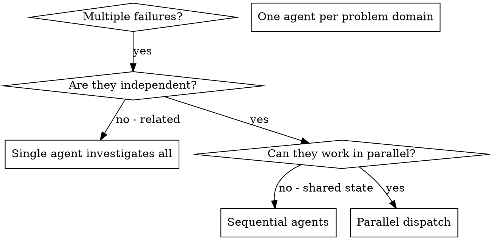

# Dispatching Parallel Agents

## Overview

When you have multiple unrelated failures or tasks (different test files, different subsystems, different bugs), investigating them sequentially wastes time. Each investigation is independent and can happen in parallel.

**Core principle:** Dispatch one agent per independent problem domain. Let them work concurrently.

## When to Use



**Use when:**
- 3+ test files failing with different root causes
- Multiple subsystems broken independently
- No shared state between investigations

**Don't use when:**
- Failures are related (fix one might fix others)
- Need to understand full system state
- Agents would interfere with each other (editing same files)

## The Pattern

### 1. Identify Independent Domains

Group failures by what's broken. Each domain is independent.

### 2. Create Focused Agent Tasks

Each agent gets:
- **Specific scope:** One test file or subsystem
- **Clear goal:** Make these tests pass
- **Constraints:** Don't change other code
- **Expected output:** Summary of root cause and fixes

### 3. Dispatch in Parallel

Use Task tool to dispatch multiple agents simultaneously.

### 4. Review and Integrate

When agents return:
- Read each summary
- Verify fixes don't conflict
- Run full test suite
- Integrate all changes

## Agent Prompt Structure

Good agent prompts are:
1. **Focused** - One clear problem domain
2. **Self-contained** - All context needed to understand the problem
3. **Specific about output** - What should the agent return?

```markdown
Fix the 3 failing tests in src/agents/agent-tool-abort.test.ts:

1. "should abort tool with partial output capture" - expects 'interrupted at' in message
2. "should handle mixed completed and aborted tools" - fast tool aborted instead of completed

These are timing/race condition issues. Your task:
1. Read the test file and understand what each test verifies
2. Identify root cause
3. Fix by replacing arbitrary timeouts with event-based waiting

Do NOT just increase timeouts - find the real issue.
Return: Summary of what you found and what you fixed.
```

## Common Mistakes

**Too broad:** "Fix all the tests" → agent gets lost
**No context:** "Fix the race condition" → agent doesn't know where
**No constraints:** Agent might refactor everything
**Vague output:** "Fix it" → you don't know what changed

## Verification

After agents return:
1. **Review each summary** - Understand what changed
2. **Check for conflicts** - Did agents edit same code?
3. **Run full suite** - Verify all fixes work together
4. **Spot check** - Agents can make systematic errors

## Key Benefits

1. **Parallelization** - Multiple investigations simultaneously
2. **Focus** - Each agent has narrow scope
3. **Independence** - Agents don't interfere
4. **Speed** - 3 problems solved in time of 1
