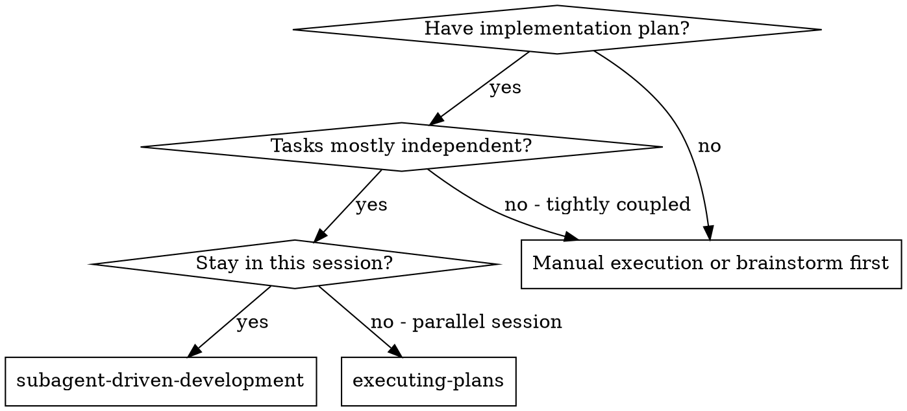

# Subagent-Driven Development

Execute plan by dispatching fresh subagent per task, with two-stage review after each: spec compliance review first, then code quality review.

**Why subagents:** Fresh context per task, no context pollution, isolated execution. You construct exactly what they need — they never inherit your session's context or history.

**Core principle:** Fresh subagent per task + two-stage review (spec then quality) = high quality, fast iteration

## When to Use

## The Process

For each task:
1. Dispatch implementer subagent with full task text + context
2. Answer any questions before they proceed
3. After implementation: dispatch spec compliance reviewer
4. If spec issues found: implementer fixes, re-review
5. After spec ✅: dispatch code quality reviewer
6. If quality issues found: implementer fixes, re-review
7. After quality ✅: mark task complete in TodoWrite
8. Repeat for next task

After all tasks: dispatch final code reviewer, then use superpowers:finishing-a-development-branch

## Model Selection

- **Mechanical tasks** (1-2 files, clear spec): fast/cheap model
- **Integration tasks** (multi-file, pattern matching): standard model
- **Architecture/review tasks**: most capable model

## Handling Implementer Status

- **DONE:** Proceed to spec compliance review
- **DONE_WITH_CONCERNS:** Read concerns before proceeding; address correctness issues
- **NEEDS_CONTEXT:** Provide missing context and re-dispatch
- **BLOCKED:** Assess blocker — provide context, upgrade model, break task smaller, or escalate to human

**Never** force the same model to retry without changes.

## Red Flags

**Never:**
- Start on main/master branch without explicit user consent
- Skip reviews (spec compliance OR code quality)
- Proceed with unfixed issues
- Dispatch multiple implementation subagents in parallel
- Make subagent read plan file (provide full text instead)
- Accept "close enough" on spec compliance
- **Start code quality review before spec compliance is ✅**
- Move to next task while either review has open issues

## Integration

**Required workflow skills:**
- **superpowers:using-git-worktrees** - REQUIRED before starting
- **superpowers:writing-plans** - Creates the plan this skill executes
- **superpowers:finishing-a-development-branch** - Complete after all tasks

**Subagents should use:**
- **superpowers:test-driven-development** - For each implementation task
